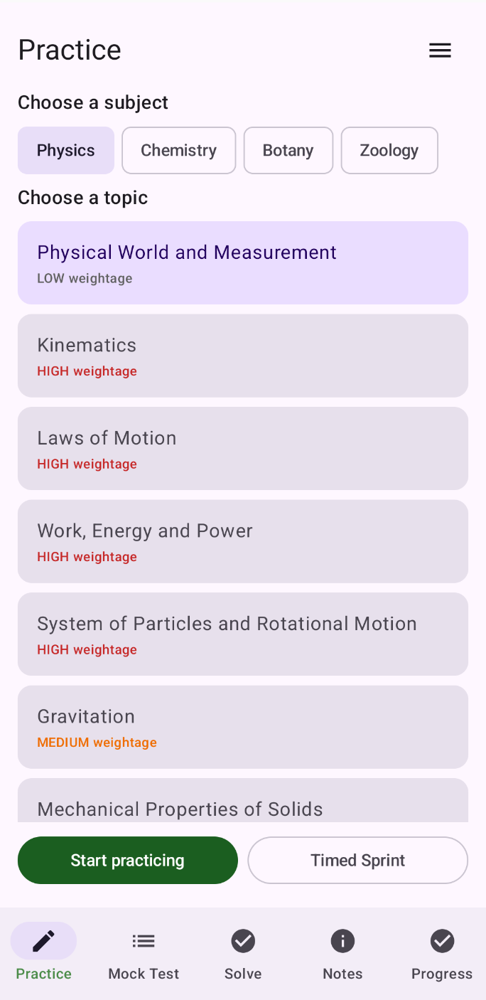
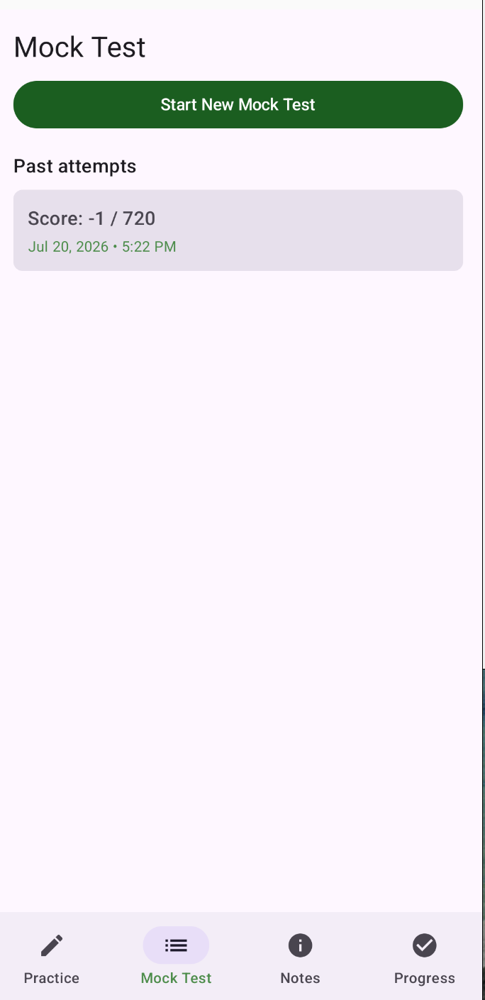
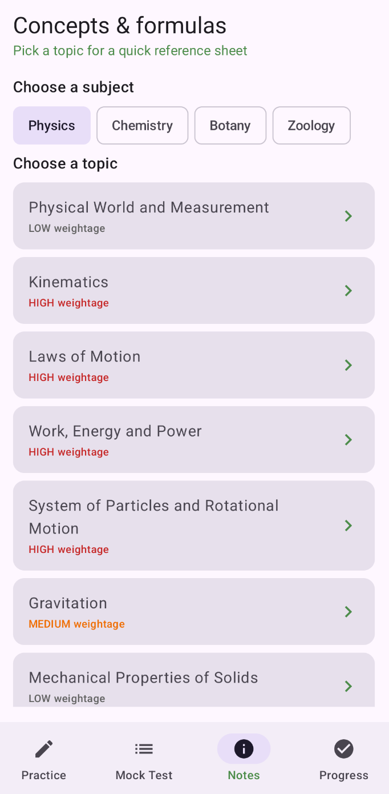
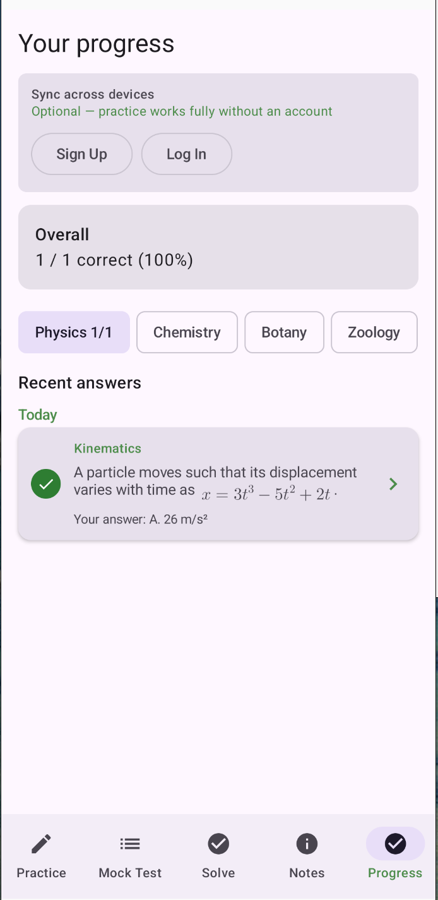

# Neet

> An AI-powered Android application for **NEET (India's medical entrance exam)** that generates unlimited syllabus-aligned practice questions, mock tests, notes, and flashcards using OpenAI.

<p align="center">
  <!-- Add screenshots here -->
  
  
  
  
</p>

## Highlights

- 📚 Complete official NEET syllabus (Physics, Chemistry, Botany, Zoology)
- 🤖 Unlimited AI-generated MCQs with detailed explanations
- 📈 Adaptive difficulty based on your performance
- 🎯 Smart Practice targeting weak topics
- ⏱️ Full-length NEET-style mock tests
- 📝 AI-generated notes and flashcards
- 📄 Export notes and completed mock tests as PDFs
- 📊 Progress tracking, mistake review, and syllabus coverage heatmaps
- 🔐 Optional cloud sync across devices
- ➗ Native LaTeX rendering for mathematical expressions

---

## Tech Stack

| Android | Backend | AI & Database |
|---------|----------|---------------|
| Kotlin | Kotlin | OpenAI API |
| Jetpack Compose | Ktor | PostgreSQL |
| Room | Exposed ORM | JWT Authentication |
| Markwon (Markdown + LaTeX) | Kotlinx Serialization | |

---

## Architecture

```text
           Android App
      (Jetpack Compose)
               │
               ▼
          Ktor Backend
               │
      ┌────────┴────────┐
      ▼                 ▼
        OpenAI API   PostgreSQL
```

---

## Features

### Practice

- Unlimited AI-generated questions
- Adaptive difficulty
- Duplicate question prevention
- Rich explanations with LaTeX support

### Smart Practice

Automatically builds a focused practice session from your weakest topics using previous performance and syllabus weightage.

### Timed Sprint

- 10 questions
- 10-minute timer
- Topic-specific revision

### Mock Tests

- Real NEET exam structure
- Timed sessions
- Review mode after submission
- PDF export

### Notes

- AI-generated notes
- Flashcards
- Server-side caching
- PDF export

### Progress

- Subject-wise accuracy
- Mistake review
- Coverage heatmap
- Revision tracker

### Accounts

Accounts are optional.

Without signing in:

- Practice
- Mock tests
- Notes
- Local progress tracking

Signing in additionally enables cloud synchronization across devices.

---

## Getting Started

### Run the Android App

The debug build is configured to use a deployed backend by default, so no backend setup is required.

```bash
cd android

export JAVA_HOME=$(/usr/libexec/java_home)

./gradlew assembleDebug
./gradlew installDebug
```

> `installDebug` requires an Android emulator or a physical Android device connected through ADB.

To start the existing emulator manually and launch the app:

```bash
cd android

/Users/saurabhmaurya/Library/Android/sdk/emulator/emulator -avd neet_test

JAVA_HOME=$(/usr/libexec/java_home) ./gradlew installDebug
/Users/saurabhmaurya/Library/Android/sdk/platform-tools/adb shell am start -n com.neet.app/.MainActivity
```

---

### Run Your Own Backend

```bash
cd backend

cp .env.example .env
```

Configure:

```text
OPENAI_API_KEY=
DATABASE_URL=
JWT_SECRET=
```

Start the server:

```bash
./gradlew run
```

The server starts on:

```
http://localhost:8080
```

---

## Backend API

| Endpoint | Description |
|----------|-------------|
| `POST /questions/generate` | Generate a practice question |
| `POST /mock-test/generate` | Generate a mock test |
| `GET /notes/{subject}/{topic}` | Retrieve or generate notes |
| `POST /auth/signup` | Create account |
| `POST /auth/login` | Login |
| `POST /sync/push` | Upload progress |
| `GET /sync/pull` | Download progress |

---

## Repository Structure

```text
Neet/
├── android/      # Jetpack Compose application
└── backend/      # Ktor backend
```

---

## Implementation Highlights

Some engineering decisions behind the project:

- **Answer verification** – Every generated question is independently verified by a second OpenAI pass to improve answer reliability.
- **Adaptive difficulty** – Difficulty is selected automatically based on weighted randomness and recent topic performance.
- **Duplicate prevention** – Previously seen questions are avoided by sending recent stems back to the backend.
- **Notes caching** – Generated notes are cached globally in PostgreSQL to avoid repeated AI generation.
- **Background prefetching** – The next question is generated while the current one is being reviewed, reducing perceived latency.
- **Local-first design** – Progress is stored locally using Room and optionally synchronized across devices.

---

## Roadmap

- Play Store release
- Push notifications
- Offline question generation
- Subscription support

---

## License

Add your preferred open-source license.
